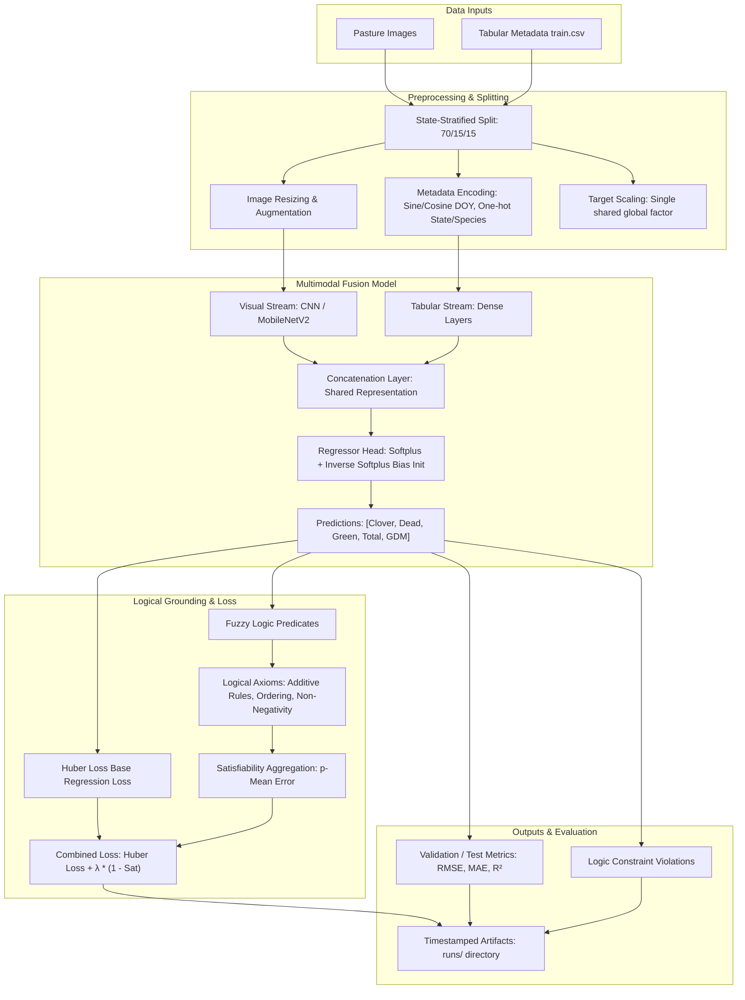

# Biomass Prediction Using Logical Tensor Networks (LTN)

This repository contains a neuro-symbolic framework for predicting pasture biomass by combining visual inputs (pasture plots) with categorical/numeric agricultural metadata using **Logical Tensor Networks (LTN)**.

Logical Tensor Networks integrate deep learning perception with symbolic domain knowledge (fuzzy logic rules). This ensures that predictions satisfy key agronomic equations and constraints while maintaining high regression accuracy.

---

## Pipeline Architecture

The flowchart below illustrates the end-to-end training and evaluation pipeline, combining multimodal deep learning with Logical Tensor Network constraint enforcement:



---


## Getting Started

### 1. Prerequisites & Environment Setup
Clone the repository, create a virtual environment, and install dependencies. This codebase is compatible with Windows (utilizing TensorFlow 2.10.1 and NumPy 1.23.5 for native Windows GPU/CPU compatibility) as well as Linux/macOS.

```powershell
# Clone the repository
git clone https://github.com/HimalGarg/Biomass-prediction-using-LTN-Neurosymbolic-AI-framework-.git
cd Biomass-prediction-using-LTN-Neurosymbolic-AI-framework-

# Create a virtual environment
python -m venv .venv

# Activate the virtual environment
# On Windows PowerShell:
.\.venv\Scripts\Activate.ps1
# On Linux/macOS:
source .venv/bin/activate

# Install dependencies
python -m pip install --upgrade pip
python -m pip install -r requirements.txt
```

### 2. Dataset Setup
Due to storage limits, the pasture image files are not tracked in this repository. 
- Download the dataset from the following link: [DATASET](https://drive.google.com/drive/folders/1XyH6rTynUgFEjCnEm1h6Tj9Mf8ud9cNk)
- Unpack/copy the image files into a directory named `Images/` in the root of this project. The directory structure should look like:
  ```text
  ├── Biomass-prediction-using-LTN-...
  │   ├── Images/
  │   │   ├── ID1011485656.jpg
  │   │   ├── ID1012260530.jpg
  │   │   └── ...
  │   ├── train.csv
  │   ├── train.py
  │   └── ...
  ```

---

## Exploratory Data Analysis (EDA)

You can explore the detailed data analysis, principal component analysis (PCA), class imbalance checks, correlation studies, and agricultural logic validation directly in the provided Jupyter Notebook:
*   [biomass_ltn_analysis.ipynb](biomass_ltn_analysis.ipynb)
*   To execute the notebook refer 

### Running EDA Notebook
Create separate directory and virtual enviornment for the EDA notebook.

Run:
```powershell
pip install -r requirements_EDA.txt
```
NOTE:
*   Use Python 3.10 only.
*   Put train.csv and Images dataset folders in the same directory as the notebook.

---
## Running the Code

### Quick Smoke Test
To verify the training loop, environment setup, and LTN grounding run a quick 1-epoch test with a subset of the dataset:
```powershell
python train.py --mode ltn --epochs 1 --image-size 64 --batch-size 8 --limit-samples 40 --no-augment
```

### Reproduce Optimal Tuned Run (Neural vs. Symbolic vs. LTN)
To reproduce the optimal model configuration that successfully balances regression performance ($R^2$) with physical/logic constraint satisfaction (Huber loss, softplus activation, state-stratified splits, and tuned logical constraints), execute:
```powershell
python train.py --mode all --epochs 40 --image-size 160 --batch-size 8 --backbone mobilenetv2 --mobilenet-weights imagenet --ltn-weight 0.01 --rule-tolerance 0.12
```

---

## Key Technical Features

1.  **State-Stratified Data Splitting**: Handles geographic class imbalance across states by ensuring train, validation, and test splits preserve the distribution of the `State` column.
2.  **Softplus Activation Regressor**: Replaces bounded sigmoid or dead-ReLU activations with a continuous, positive-only `softplus` `f(x) = \log(1 + e^x)` function, avoiding target prediction zero-locks ("dead ReLUs").
3.  **Huber Loss Objective**: Swaps standard Mean Squared Error (MSE) for Huber Loss (`delta=0.15`), stabilizing training against outliers and skewed biomass target values.
4.  **Agro-Fuzzy Constraints**:
    *   `Dry_Total_g = Dry_Clover_g + Dry_Dead_g + Dry_Green_g`
    *   `GDM_g = Dry_Clover_g + Dry_Green_g`
    *   Non-negativity bounds.
    *   Logical ordering constraints (e.g., aggregate weights must be greater than or equal to constituent weights).

---

## Outputs & Artifacts
Each run creates a timestamped output directory under `runs/` containing:
*   `config.json`: Run configuration parameters.
*   `run_report.md`: Markdown summary of the run metrics.
*   `metrics_all.csv` & `rules_all.csv`: Loss, metrics, and rule violation rates.
*   `predictions/`: Output CSV files with actual vs. predicted values.
*   `figures/`: Generated training curves, predicted-vs-actual scatters, and logic violation comparisons.

For a full technical report on the design decisions and logical grounding formulas, refer to the [REPORT.md](REPORT.md).
