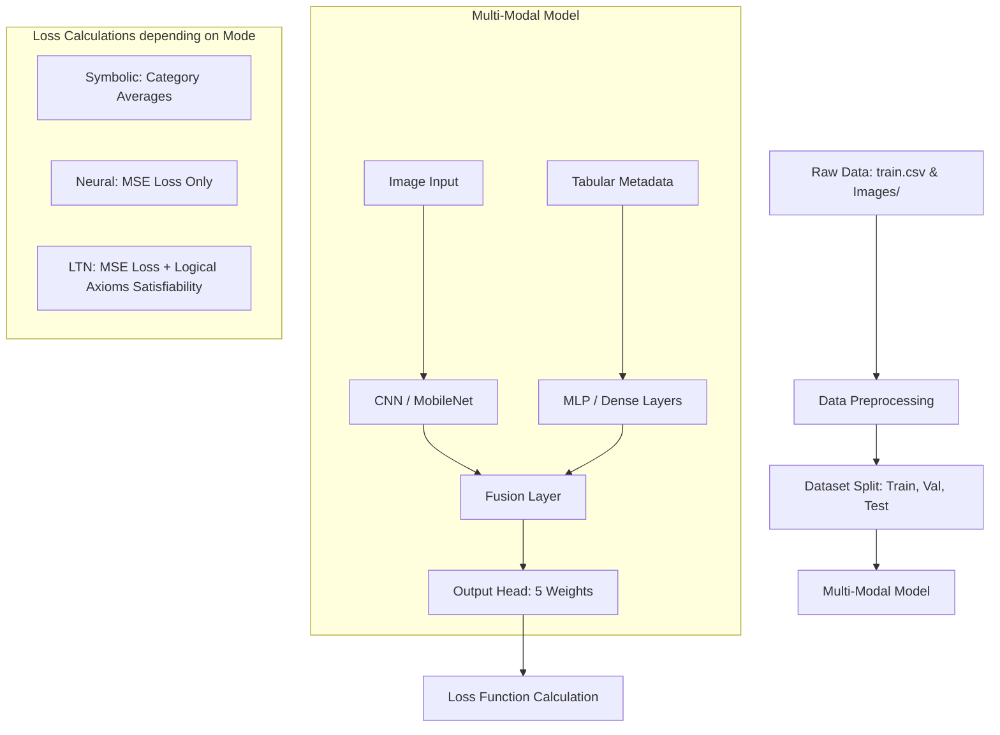

# Understanding the Biomass LTN Project

This guide explains the project in plain English, assuming no prior knowledge of Logical Tensor Networks (LTNs). It breaks down what the project is, what it predicts, how the code runs, and the differences between the learning modes.

---

## 1. What is this Project About?

### The Core Goal
In agriculture, knowing how much plant material (biomass) is growing in a pasture is critical for managing livestock and estimating feed availability. Historically, measuring this required walking out, cutting grass, drying it in an oven, and weighing it—a slow and labor-intensive process.

This project predicts **pasture biomass weights** automatically by combining two sources of information:
1. **Images**: Photos of the pasture plots.
2. **Metadata**: Tabular data collected at the scene (like plant height, location, species, and sensor readings like NDVI).

### What is Being Predicted?
The model predicts **five specific weight values (in grams)** for each pasture photo:
*   `Dry_Clover_g`: Weight of dry clover.
*   `Dry_Dead_g`: Weight of dry dead plant material.
*   `Dry_Green_g`: Weight of dry green grass/herbage.
*   `Dry_Total_g`: Total dry biomass weight.
*   `GDM_g`: Green Dry Matter weight.

### The Hidden Rules (Domain Knowledge)
In physics and biology, variables have constraints. We know certain mathematical relationships *must* hold true:
1. **Total Biomass Equation**: Total weight must equal the sum of clover, dead, and green grass.
   $$\text{Dry\_Total\_g} = \text{Dry\_Clover\_g} + \text{Dry\_Dead\_g} + \text{Dry\_Green\_g}$$
2. **Green Dry Matter Equation**: Green Dry Matter (GDM) must equal the sum of clover and green grass.
   $$\text{GDM\_g} = \text{Dry\_Clover\_g} + \text{Dry\_Green\_g}$$
3. **Non-negativity**: You cannot have negative weights.
   $$\text{All predictions} \geq 0$$
4. **Order Consistency**: Total dry weight must be greater than or equal to GDM, which in turn must be greater than or equal to the individual components.

---

## 2. What is a Logical Tensor Network (LTN)?

### The Problem with Normal Deep Learning (Neural Networks)
Normal Neural Networks are excellent at recognizing patterns in images and tables, but they are "blind" to logic. 
* If you train a normal neural network to predict the 5 weights, it might predict:
  * Clover = $10\text{g}$
  * Dead = $5\text{g}$
  * Green = $15\text{g}$
  * Total = $40\text{g}$ (Wait, $10 + 5 + 15 = 30$, not $40$!)
* Because the network only minimizes numerical errors (e.g. Mean Squared Error) on individual labels, it doesn't understand that the outputs must relate to each other logically.

### The LTN Solution: Differentiable Logic
**Logical Tensor Networks (LTNs)** bridge the gap between **deep learning** (neural networks) and **symbolic reasoning** (rules and logic).

*   **Traditional Logic (Boolean)**: Statements are either strictly True ($1$) or strictly False ($0$). This cannot be used in neural network training because neural networks learn using calculus (gradients/derivatives), which requires smooth, continuous values.
*   **Fuzzy Logic**: Statements have a **truth value** anywhere between $0.0$ (completely false) and $1.0$ (completely true). For example, if Clover ($10$) + Dead ($5$) + Green ($15$) = Total ($30.1$), the rule is *almost* true (truth value $\approx 0.99$).
*   **LTN Integration**: An LTN translates logical rules (e.g., "Total = Clover + Dead + Green") into mathematical operations. It outputs a score called **Satisfiability** (how well the rules are obeyed, from $0$ to $1$). We can then feed this satisfiability score directly into the training loop, forcing the model to minimize prediction errors **and** maximize rule satisfaction at the same time.

---

## 3. How the Code Flows and Runs

When you run the code, it performs a sequence of steps:

### Inside the Multi-Modal Model
The model has two "streams" or branches:
1.  **Image Branch**: Takes the pasture photo and runs it through a Convolutional Neural Network (CNN) to extract visual features (like color, texture, and plant density).
2.  **Tabular Branch**: Takes numerical metadata (plant height, NDVI) and categorical data (State, Species) and processes them through an MLP (Multi-Layer Perceptron).
3.  **Fusion & Output**: The visual features and tabular features are merged (concatenated) and passed through final layers to predict all 5 target weights simultaneously.

---

## 4. The Learning Modes Explained

When you run training, you choose a `--mode`. Here is what each mode means:

### 1. Symbolic Mode (`--mode symbolic`)
*   **How it works**: It is a baseline algorithm. Instead of using a neural network or looking at images, it calculates the historical average biomass values for each category (e.g., each unique combination of State and Species) from the training data.
*   **Logical Rules**: Because it knows the mathematical rules, it predicts the three base components (Clover, Dead, Green) and then *calculates* the Total and GDM by summing them up.
*   **Pros**: Perfectly follows all logical rules ($100\%$ satisfiability).
*   **Cons**: Cannot learn from images or unique metadata features. It predicts the exact same average values for any two pastures of the same species/state.

### 2. Neural Mode (`--mode neural`)
*   **How it works**: It trains the Multi-Modal Neural Network using only **Mean Squared Error (MSE)** loss. It adjusts its weights to get the predictions as close as possible to the true labels.
*   **Logical Rules**: It has no concept of rules. It doesn't know that Total must equal Clover + Dead + Green.
*   **Pros**: Learns complex patterns from images and fine-grained tabular features.
*   **Cons**: Frequently makes physically impossible predictions (e.g., Total is smaller than Green, or the sum is completely off).

### 3. LTN Mode (`--mode ltn`)
*   **How it works**: It trains the exact same Multi-Modal Neural Network, but its loss function is a combination of **MSE Loss** and **Logical Axiom Violations**.
*   **Logical Rules**: The logic module (`biomass_ltn/logic.py`) checks the rules for every batch. If the model makes predictions that violate the equations, a penalty is added to the loss function.
*   **Pros**: Combines the best of both worlds. It learns rich patterns from images/data while respecting real-world physics and mathematical equations.

### 4. All Mode (`--mode all`)
*   Runs all three modes (`symbolic`, `neural`, and `ltn`) one after another.
*   Compares their performance side-by-side using metrics (MSE) and rule adherence (Satisfiability).

---

## 5. Key Training Mechanics in `train.py`

To train the LTN model successfully, the training loop uses a few clever tricks:

1.  **Warmup Epochs**: During the first few epochs (e.g., 5 epochs), the model ignores the logical rules and focuses purely on matching the data labels (MSE). This gives the neural network a starting point before we restrict it with rules.
2.  **Constraint Weight Ramp-up**: We gradually increase the penalty for logical rule violations. At first, we let the model make slight logical errors. As training goes on, the penalty gets stricter, forcing the model to align its predictions with the equations.
3.  **Early Stopping**: We monitor the validation loss. If the model stops improving for a set number of epochs, we stop training and restore the best-performing weights to prevent overfitting.
